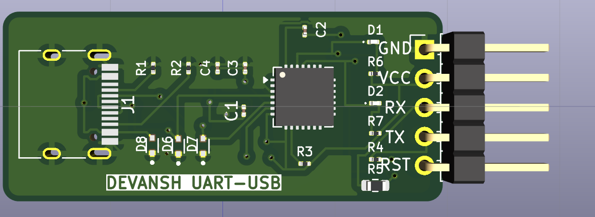

# USB-to-UART Converter PCB Design using KiCad 9

<div align="left">



**A compact two-layer USB-to-UART converter PCB designed from schematic capture to fabrication-ready manufacturing files using KiCad 9.**

 


</div>

---

# Project Overview

Modern computers primarily communicate using **USB**, while many embedded systems, microcontrollers, and development boards communicate using **UART (Universal Asynchronous Receiver Transmitter)**. Since these two communication protocols are not directly compatible, a USB-to-UART bridge is required.

This project presents the complete hardware design of a **USB-to-UART Converter PCB** developed entirely in **KiCad 9**. The design converts USB communication into UART signals using the **Silicon Labs CP2102N USB-to-UART Bridge Controller**, enabling reliable serial communication between a host computer and external embedded systems.

The project demonstrates the complete PCB development lifecycle, including:

- Requirement Analysis
- Schematic Design
- PCB Layout
- Component Placement
- Manual Routing
- Ground Plane Implementation
- ERC & DRC Verification
- Gerber Generation
- Drill File Generation
- Technical Documentation

---

# Why this Project?

Many embedded development boards expose only UART communication.

Examples include:

- STM32 Boards
- AVR Microcontrollers
- PIC Microcontrollers
- ESP32
- 8051 Development Boards
- FPGA Development Boards
- Custom Embedded Hardware

Since modern laptops generally provide USB ports instead of UART ports, a USB-to-UART converter is commonly used for:

- Firmware Uploading
- Serial Debugging
- Bootloader Programming
- Embedded Development
- Device Configuration
- Industrial Communication

This project implements that interface in the form of a compact two-layer PCB.

---

# Project Objectives

The objectives of this project were to:

- Design a complete USB-to-UART converter schematic.
- Develop a compact two-layer PCB.
- Implement efficient component placement.
- Perform manual PCB routing.
- Implement proper power distribution.
- Generate fabrication-ready manufacturing files.
- Verify the design using ERC and DRC.
- Produce complete engineering documentation.

---

# System Architecture

```
                 Host Computer
                       │
                 USB Type-C Cable
                       │
                       ▼
              USB Type-C Connector
                       │
                       ▼
              USB Protection Circuit
          (ESD Protection + CC Resistors)
                       │
                       ▼
               Power Distribution
             (VBUS + Decoupling Network)
                       │
                       ▼
             CP2102N USB-UART Bridge
                       │
          ┌────────────┴────────────┐
          │                         │
         TX                        RX
          │                         │
          └────────────┬────────────┘
                       ▼
                UART Output Header
         GND | VBUS | RX | TX | RST
```

---

# Hardware Features

- USB Type-C Interface
- CP2102N USB-to-UART Bridge
- UART Communication
- Reset Pin
- TX/RX Status LEDs
- USB ESD Protection
- CC Pull-Down Configuration
- Decoupling Capacitors
- Two-Layer PCB
- Compact PCB Layout
- Ground Plane Implementation

---

# Major Hardware Components

| Component | Purpose |
|------------|----------|
| USB Type-C Connector | USB Interface |
| CP2102N | USB-to-UART Protocol Conversion |
| CC Resistors | USB Type-C Configuration |
| ESD Protection Diodes | USB Protection |
| Decoupling Capacitors | Power Filtering |
| TX/RX LEDs | Communication Status |
| UART Header | External UART Interface |

---

# PCB Design Flow

```
Requirements Analysis
        │
        ▼
Component Selection
        │
        ▼
Schematic Design
        │
        ▼
Footprint Assignment
        │
        ▼
ERC Verification
        │
        ▼
PCB Layout
        │
        ▼
Component Placement
        │
        ▼
Manual Routing
        │
        ▼
Ground Plane
        │
        ▼
DRC Verification
        │
        ▼
Gerber Generation
        │
        ▼
Drill File Generation
        │
        ▼
Project Documentation
```

---

# Design Highlights

### Schematic Design

- Complete circuit designed from scratch.
- USB interface implementation.
- Power network design.
- UART interface.
- LED indicators.
- USB protection circuitry.

---

### PCB Layout

- Two-layer PCB.
- Compact board size.
- Manual routing.
- Optimized signal flow.
- Organized component placement.
- Ground plane implementation.

---

### Routing Strategy

- Short signal paths.
- Reduced routing congestion.
- Logical component grouping.
- Efficient via usage.
- Clean power routing.

---

### Verification

Electrical verification was performed using KiCad.

✔ Electrical Rules Check (ERC)

✔ Design Rules Check (DRC)

---

### Manufacturing Outputs

Fabrication files generated include:

- Gerber Files
- Drill Files
- PCB Layout
- Native KiCad Project
- Verification Reports

---

# Repository Structure

```
USB-to-UART-Converter/

│
├── README.md
│
├── Project/
│   ├── USB_to_UART.kicad_pro
│   ├── USB_to_UART.kicad_sch
│   ├── USB_to_UART.kicad_pcb
│
├── Gerber/
│   ├── F_Cu.gbr
│   ├── B_Cu.gbr
│   ├── F_Mask.gbr
│   ├── B_Mask.gbr
│   ├── F_Silkscreen.gbr
│   ├── Edge_Cuts.gbr
│
├── Drill/
│   ├── USB_to_UART-PTH.drl
│   ├── USB_to_UART-NPTH.drl
│
├── Reports/
│   ├── PCB_Design_Report.pdf
│   ├── Gerber_Report.pdf
│   ├── Drill_Report.pdf
│   ├── ERC_DRC_Report.pdf
│
├── Images/
│   ├── Schematic.png
│   ├── PCB_Layout.png
│   ├── PCB_3D_Front.png
│   ├── PCB_3D_Back.png
│
└── Verification/
    ├── ERC.rpt
    └── DRC.rpt
```

---

# Verification Summary

| Verification | Status |
|--------------|--------|
| ERC Completed | ✅ |
| DRC Completed | ✅ |
| PCB Routing | ✅ |
| Ground Plane | ✅ |
| Gerber Generation | ✅ |
| Drill File Generation | ✅ |

---

# Engineering Skills Demonstrated

This project demonstrates practical experience in:

- Electronic Schematic Design
- PCB Design using KiCad 9
- Footprint Management
- Component Placement
- PCB Routing
- Ground Plane Design
- Power Distribution
- USB Hardware Design
- UART Communication
- PCB Verification
- Gerber Generation
- Drill File Generation
- Technical Documentation

---

# What I Learned

Through this project I gained practical experience in:

- Designing a complete PCB from schematic to fabrication.
- Selecting electronic components and footprints.
- Planning efficient PCB layouts.
- Implementing proper grounding techniques.
- Generating manufacturing files.
- Performing electrical and layout verification.
- Preparing engineering documentation for hardware projects.

---

# Future Improvements

Potential future enhancements include:

- Hardware testing and validation on a fabricated PCB.
- Additional ESD protection.
- Test points for debugging.
- Power status LED.
- Improved silkscreen annotations.
- Version 2.0 PCB optimization.

---

# Software Used

- KiCad 9
- KiCad PCB Editor
- KiCad Schematic Editor
- KiCad 3D Viewer

---

# Applications

This PCB can be used for:

- Embedded Systems Development
- Firmware Programming
- Serial Debugging
- Bootloader Programming
- FPGA Communication
- IoT Development
- Industrial Automation
- Educational Laboratories

---

# Project Status

| Stage | Status |
|---------|--------|
| Requirements | ✅ Complete |
| Schematic Design | ✅ Complete |
| PCB Layout | ✅ Complete |
| Routing | ✅ Complete |
| ERC | ✅ Complete |
| DRC | ✅ Complete |
| Gerber Generation | ✅ Complete |
| Drill Files | ✅ Complete |
| Documentation | ✅ Complete |
| Project | ✅ Finalized |
---

## ⭐ If you found this project useful, consider giving it a star!
 
